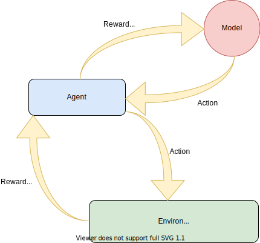
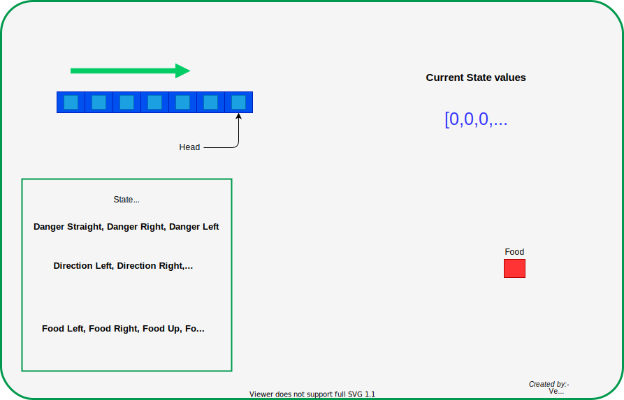
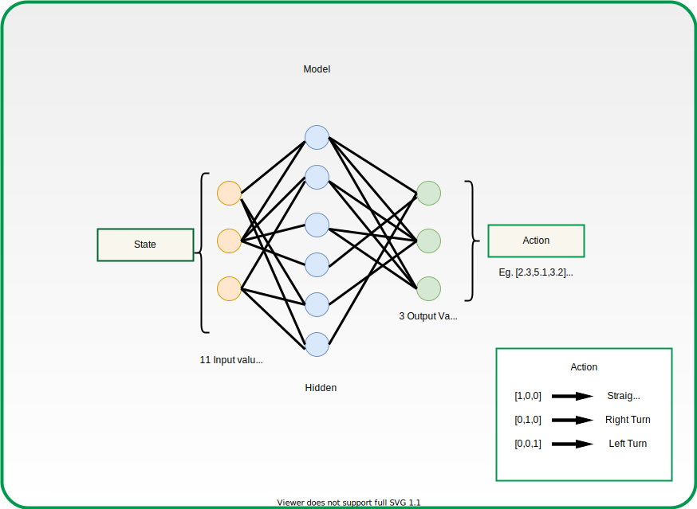
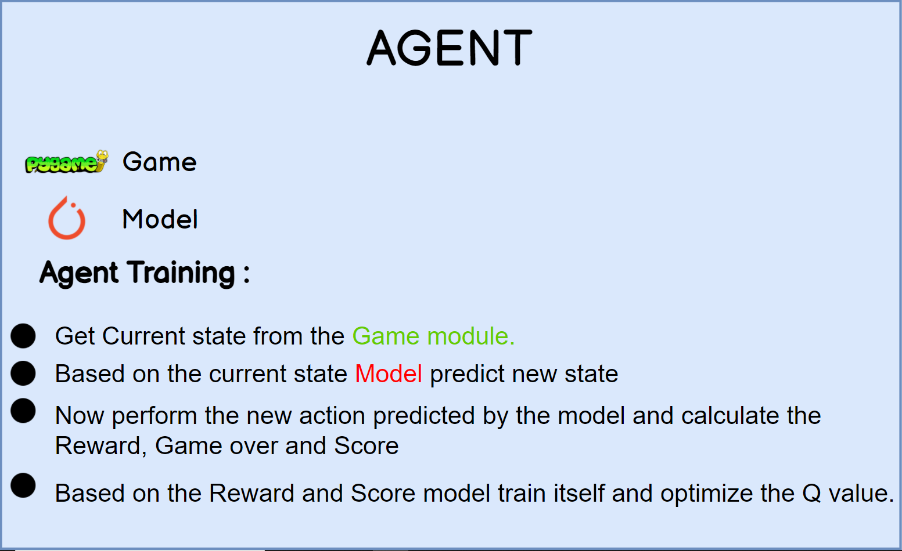
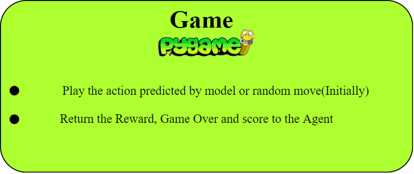
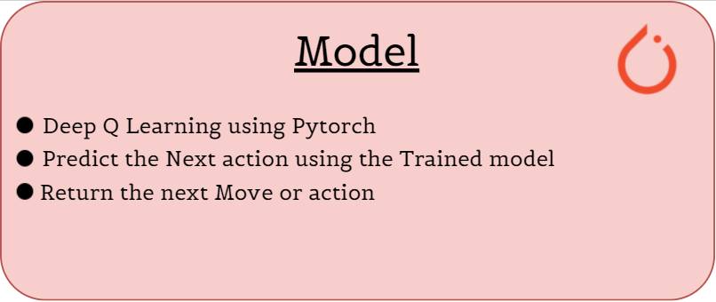
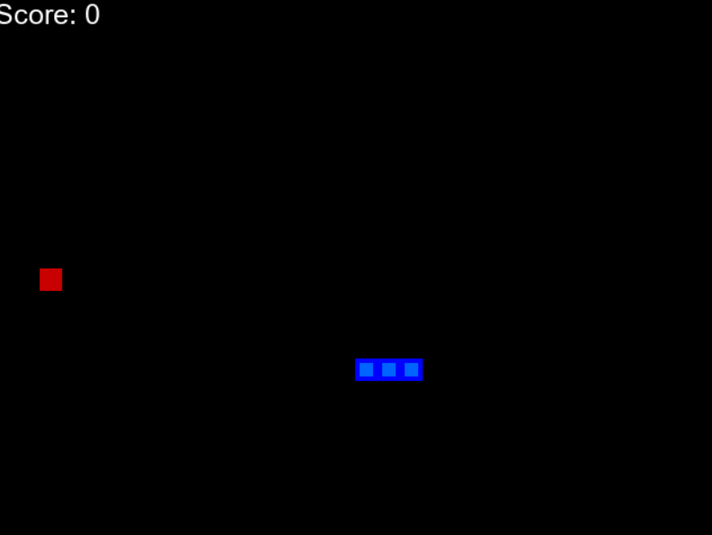
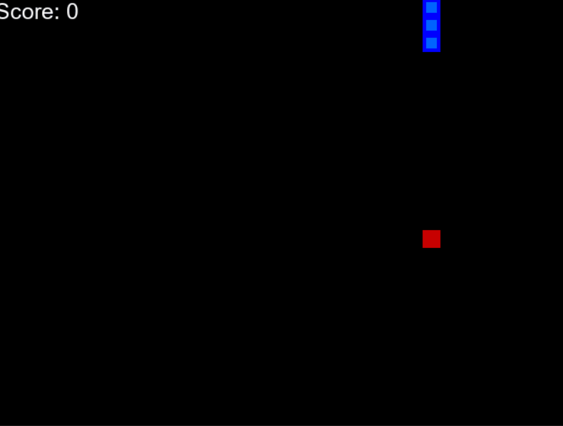

# Snake Game AI 
AI driven snake game using Reinforcement Learning and Deep Q Learning.<br>

The game of Snake actually has a trivial, unbeatable solution. It can be driven by <b> Simple Non-ML Technique </b>by just traversing every block of the board, this gives the unbeateablre solution but it is very time taking and very brute force approach.<br>

But we will be using reinforcement learning techinque.
## Reinforcement Learning
The first question arises in mind that why we are using reinforcement learning instead of supervised machine learning, the answer is, in supervised ML algorithms need to be trained with an input and a “correct answer” called target.In this example, we don’t know what the best action to take at each stage of the game is, so a traditional approach would not be effective.<br>
In Reinforcement Learning, we have two main components: the <b>environment</b> (our game) and the <b>agent</b> (our Snake.. or to be correct, the Deep Neural Network that drives our Snake’s actions). Every time the agent performs an action, the environment gives a reward to the agent, which can be positive or negative depending on <i>how good the action was from that specific state.</i>
<p align="center">


  </p>
Deep Reinforcement Learning (DRL) combines the above ideas of RL with deep neural networks. The neural network learns the “Q function”, which takes as input the current environment state and outputs a vector containing expected rewards for each possible action. The agent can then pick the action that maximizes the Q function. Based on this action, the game then updates the environment to a new state and assigns a reward (e.g. +10 for eating an apple, -10 for hitting a wall). At the beginning of training, the Q function is just approximated by a randomly initialized neural network. 


### Algorithm
We have snake and food on the board randomly placed.
* calculate the state of the snake using the 11 values 
  
* Now this current state is passed to the RL Model for the next state.
  
* After executing the next state calculate the reward. Rewards are defined as below:
  1. Eat food  :  +10
  2. Game Over :  -10
  3. Else      :    0
* Update the Q value and Train the Model.

After analysing the algorithm now we have to build the idea to proceed for coding this algorithm.<br><br>
Our Project will be divided into three Modules named <b>Agent, Game and Model</b>
  <p align='center'>
    
  </p>
  <p>
    
    
  </p>

<br><br><br><br><br><br><br><br><br><br><br><br>
<hr />
<p>
  <h2>Result</h2>


<br><br><br><br><br><br><br><br><br><br><br>
<p style="font-size:25px">
<pre>              <b> Initial Epochs</b>                                           <b>After 100<sup>th</sup> Epochs</b></pre>
</p>


#### Implementation Steps


1. Stage 1: Download the repository
1. Stage 2: Set-up the project

##### Set-up

1. To get started, first install the dependencies using:
    ```commandline
     pip install -r requirements.txt
    ```
2. Run the Python file:
   ```commandline
   streamlit run snake_game.py
   ```


